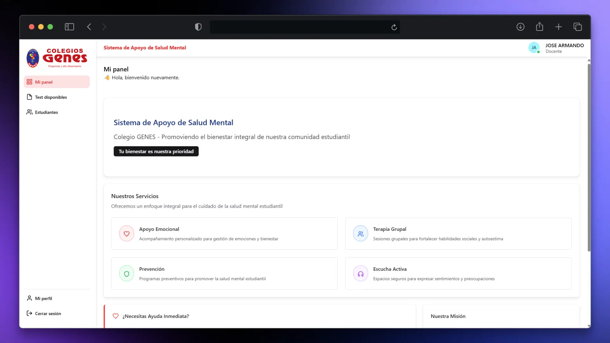

<div align="center">



# Sistema de Apoyo de Salud Mental GENES


</div>


---

## 📝 Descripción
**GENES Web** es una plataforma desarrollada como parte de un proyecto de tesis orientado al **apoyo en la salud mental de estudiantes**, integrando herramientas digitales de evaluación y el uso de **inteligencia artificial (Gemini API)** para generar observaciones preliminares que son posteriormente validadas por especialistas.  

El sistema está diseñado con un enfoque moderno y escalable, implementado con tecnologías web de última generación y pensado para facilitar la interacción de **docentes, estudiantes y psicólogos** en un entorno seguro y accesible.

---

## ✨ Funcionalidades principales
- 🧑‍🎓 **Aplicación de cuestionarios** psicométricos digitales para estudiantes.  
- 🤖 **Generación automática de observaciones** mediante IA (Gemini API).  
- 👩‍🏫 **Validación y supervisión docente/psicóloga** de los resultados.  
- 📊 **Reportes y métricas** sobre resultados individuales y grupales.  
- 🔒 **Seguridad de datos** mediante autenticación con JWT y cifrado en PostgreSQL.  
- 🌐 **Despliegue web responsivo** con una interfaz intuitiva y moderna.  

---

## 🛠️ Stack Tecnológico
- **Frontend**: React (TSX) + TypeScript + Chakra UI  
- **Estilos**: Chakra UI Components + diseño responsivo  
- **Control de versiones**: Git + GitHub  

---

## 🚀 Instalación — Instrucciones completas

> **Requisitos previos**
> - Node.js LTS (recomendado: 18.x o 20.x)  
> - npm (v8+) — o yarn / pnpm según prefieras  
> - Git

---

### 1. Clonar el repositorio
Clona el repositorio y sitúate en la carpeta del frontend (si el frontend está en una subcarpeta, cámbiate a ella).

```bash
git clone git@github.com:JoArDiTo/genes-web.git
cd genes-web
```

Instalar las dependencias del proyecto:

```bash
npm install
# o
yarn install
# o
pnpm install
```

### 3. Configurar variables de entorno

Copia el archivo de ejemplo `.env.example` a `.env` y edítalo con tus propias credenciales y configuraciones:

```bash
cp .env.example .env
```

Asegúrate de completar los valores requeridos en el archivo `.env`.

### 4. Iniciar la aplicación en modo desarrollo

```bash
npm run dev
# o
yarn dev
# o
pnpm dev
```

La aplicación estará disponible en `http://localhost:5173` (o el puerto configurado).

---
